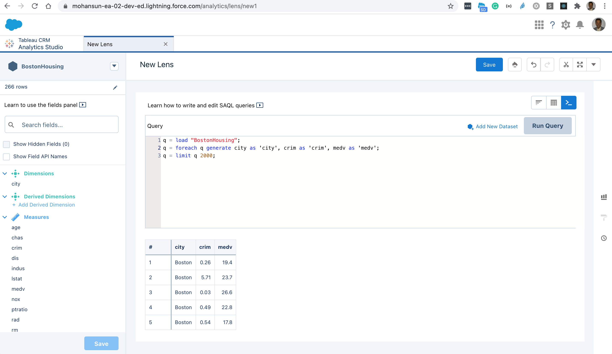
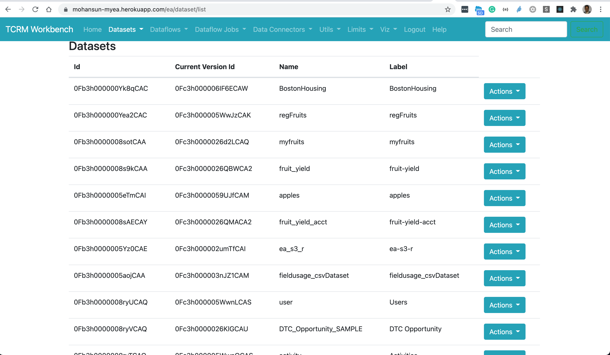
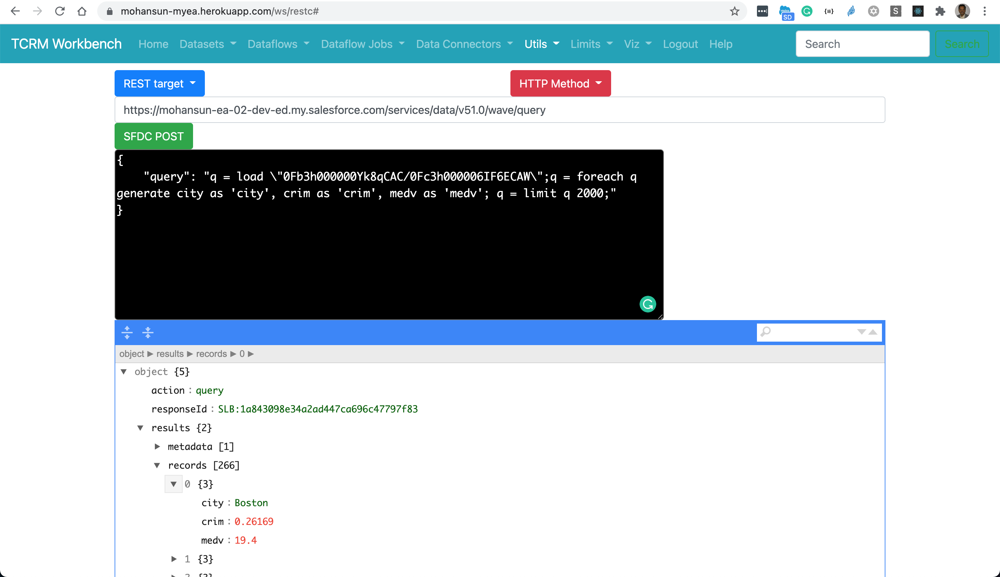

## Loading Boston Housing Data into TCRM

```
$ sfdx mohanc:ea:dataset:load -u mohan.chinnappan.n_ea2@gmail.com  -d BostonHousing.csv -o Upsert  -a BostonHousing
```
```
=== Sampling data
-- Please make sure that first row of your data does not have missing values --
[
  [
    'city',  'crim',
    'zn',    'indus',
    'chas',  'nox',
    'rm',    'age',
    'dis',   'rad',
    'tax',   'ptratio',
    'lstat', 'medv'
  ],
  [
    'Boston', '0.26169',
    '0',      '9.9',
    '0',      '0.544',
    '6.023',  '90.4',
    '2.834',  '4',
    '304',    '18.4',
    '11.72',  '19.4'
  ]
]
=== Finding the data types based on the sample data ...
[
  {
    fullyQualifiedName: 'BostonHousing.city',
    label: 'city',
    name: 'city',
    isSystemField: false,
    isUniqueId: false,
    isMultiValue: false,
    multiValueSeparator: 'null',
    type: 'Text'
  },
  {
    fullyQualifiedName: 'BostonHousing.crim',
    label: 'crim',
    name: 'crim',
    isSystemField: false,
    isUniqueId: false,
    type: 'Numeric',
    defaultValue: '0',
    precision: 18,
    scale: 5
  },
  {
    fullyQualifiedName: 'BostonHousing.zn',
    label: 'zn',
    name: 'zn',
    isSystemField: false,
    isUniqueId: false,
    type: 'Numeric',
    defaultValue: '0',
    precision: 18,
    scale: 0
  },
  {
    fullyQualifiedName: 'BostonHousing.indus',
    label: 'indus',
    name: 'indus',
    isSystemField: false,
    isUniqueId: false,
    type: 'Numeric',
    defaultValue: '0',
    precision: 18,
    scale: 1
  },
  {
    fullyQualifiedName: 'BostonHousing.chas',
    label: 'chas',
    name: 'chas',
    isSystemField: false,
    isUniqueId: false,
    type: 'Numeric',
    defaultValue: '0',
    precision: 18,
    scale: 0
  },
  {
    fullyQualifiedName: 'BostonHousing.nox',
    label: 'nox',
    name: 'nox',
    isSystemField: false,
    isUniqueId: false,
    type: 'Numeric',
    defaultValue: '0',
    precision: 18,
    scale: 3
  },
  {
    fullyQualifiedName: 'BostonHousing.rm',
    label: 'rm',
    name: 'rm',
    isSystemField: false,
    isUniqueId: false,
    type: 'Numeric',
    defaultValue: '0',
    precision: 18,
    scale: 3
  },
  {
    fullyQualifiedName: 'BostonHousing.age',
    label: 'age',
    name: 'age',
    isSystemField: false,
    isUniqueId: false,
    type: 'Numeric',
    defaultValue: '0',
    precision: 18,
    scale: 1
  },
  {
    fullyQualifiedName: 'BostonHousing.dis',
    label: 'dis',
    name: 'dis',
    isSystemField: false,
    isUniqueId: false,
    type: 'Numeric',
    defaultValue: '0',
    precision: 18,
    scale: 3
  },
  {
    fullyQualifiedName: 'BostonHousing.rad',
    label: 'rad',
    name: 'rad',
    isSystemField: false,
    isUniqueId: false,
    type: 'Numeric',
    defaultValue: '0',
    precision: 18,
    scale: 0
  },
  {
    fullyQualifiedName: 'BostonHousing.tax',
    label: 'tax',
    name: 'tax',
    isSystemField: false,
    isUniqueId: false,
    type: 'Numeric',
    defaultValue: '0',
    precision: 18,
    scale: 0
  },
  {
    fullyQualifiedName: 'BostonHousing.ptratio',
    label: 'ptratio',
    name: 'ptratio',
    isSystemField: false,
    isUniqueId: false,
    type: 'Numeric',
    defaultValue: '0',
    precision: 18,
    scale: 1
  },
  {
    fullyQualifiedName: 'BostonHousing.lstat',
    label: 'lstat',
    name: 'lstat',
    isSystemField: false,
    isUniqueId: false,
    type: 'Numeric',
    defaultValue: '0',
    precision: 18,
    scale: 2
  },
  {
    fullyQualifiedName: 'BostonHousing.medv',
    label: 'medv',
    name: 'medv',
    isSystemField: false,
    isUniqueId: false,
    type: 'Numeric',
    defaultValue: '0',
    precision: 18,
    scale: 1
  }
]
=== Preparing for the loading ...
{ id: '06V3h000000aHcGEAU', success: true, errors: [] }
-- Maximum Chunck size: 9437184 bytes --
=== Loading part: '1' with chunk size: 24516 bytes ...
{ id: '06W3h000000aUmiEAE', success: true, errors: [] }
=== Loading Complete.
Going to process...

Done.
Time taken: 20.593 seconds
open https://mohansun-ea-02-dev-ed.my.salesforce.com/analytics/dataManager in a web browser to view this job
```

## Dataset


## TCRM Workbench to SAQL for the dataset


