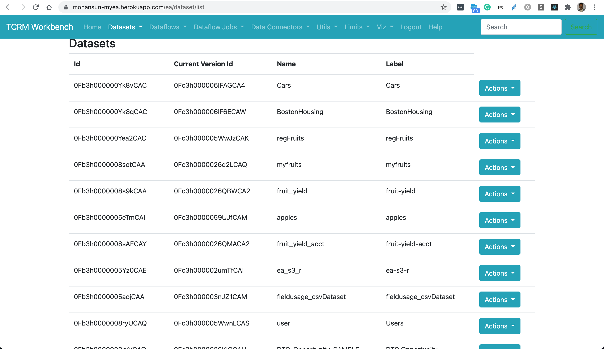

## Loading into TCRM
```
$ sfdx mohanc:ea:dataset:load -u mohan.chinnappan.n_ea2@gmail.com  -d carsData.csv -o Upsert  -a Cars
```

```
=== Sampling data
-- Please make sure that first row of your data does not have missing values --
[
  [
    'Name',
    'Miles_per_Gallon',
    'Cylinders',
    'Displacement',
    'Horsepower',
    'Weight_in_lbs',
    'Acceleration',
    'Year',
    'Origin'
  ],
  [
    'chevrolet chevelle malibu',
    '18',
    '8',
    '307',
    '130',
    '3504',
    '12',
    '1970-01-01',
    'USA'
  ]
]
=== Finding the data types based on the sample data ...
[
  {
    fullyQualifiedName: 'Cars.Name',
    label: 'Name',
    name: 'Name',
    isSystemField: false,
    isUniqueId: false,
    isMultiValue: false,
    multiValueSeparator: 'null',
    type: 'Text'
  },
  {
    fullyQualifiedName: 'Cars.Miles_per_Gallon',
    label: 'Miles_per_Gallon',
    name: 'Miles_per_Gallon',
    isSystemField: false,
    isUniqueId: false,
    type: 'Numeric',
    defaultValue: '0',
    precision: 18,
    scale: 0
  },
  {
    fullyQualifiedName: 'Cars.Cylinders',
    label: 'Cylinders',
    name: 'Cylinders',
    isSystemField: false,
    isUniqueId: false,
    type: 'Numeric',
    defaultValue: '0',
    precision: 18,
    scale: 0
  },
  {
    fullyQualifiedName: 'Cars.Displacement',
    label: 'Displacement',
    name: 'Displacement',
    isSystemField: false,
    isUniqueId: false,
    type: 'Numeric',
    defaultValue: '0',
    precision: 18,
    scale: 0
  },
  {
    fullyQualifiedName: 'Cars.Horsepower',
    label: 'Horsepower',
    name: 'Horsepower',
    isSystemField: false,
    isUniqueId: false,
    type: 'Numeric',
    defaultValue: '0',
    precision: 18,
    scale: 0
  },
  {
    fullyQualifiedName: 'Cars.Weight_in_lbs',
    label: 'Weight_in_lbs',
    name: 'Weight_in_lbs',
    isSystemField: false,
    isUniqueId: false,
    type: 'Numeric',
    defaultValue: '0',
    precision: 18,
    scale: 0
  },
  {
    fullyQualifiedName: 'Cars.Acceleration',
    label: 'Acceleration',
    name: 'Acceleration',
    isSystemField: false,
    isUniqueId: false,
    type: 'Numeric',
    defaultValue: '0',
    precision: 18,
    scale: 0
  },
  {
    fullyQualifiedName: 'Cars.Year',
    label: 'Year',
    name: 'Year',
    isSystemField: false,
    isUniqueId: false,
    isMultiValue: false,
    multiValueSeparator: 'null',
    type: 'Text'
  },
  {
    fullyQualifiedName: 'Cars.Origin',
    label: 'Origin',
    name: 'Origin',
    isSystemField: false,
    isUniqueId: false,
    isMultiValue: false,
    multiValueSeparator: 'null',
    type: 'Text'
  }
]
=== Preparing for the loading ...
{ id: '06V3h000000aHcQEAU', success: true, errors: [] }
-- Maximum Chunck size: 9437184 bytes --
=== Loading part: '1' with chunk size: 33372 bytes ...
{ id: '06W3h000000aUmsEAE', success: true, errors: [] }
=== Loading Complete.
Going to process...

Done.
Time taken: 10.943 seconds
open https://mohansun-ea-02-dev-ed.my.salesforce.com/analytics/dataManager in a web browser to view this job
```

## Dataset 


## TCRM Workbench to SAQL for the dataset

### SAQL
```
{
    "query": "q = load \"0Fb3h000000Yk8vCAC/0Fc3h000006IFAGCA4\";q = foreach q generate  Name as 'Name', Miles_per_Gallon as 'Miles_per_Gallon', Horsepower as 'Horsepower',Cylinders as 'Cylinders'; ​q = limit q 2000;"
}
```

