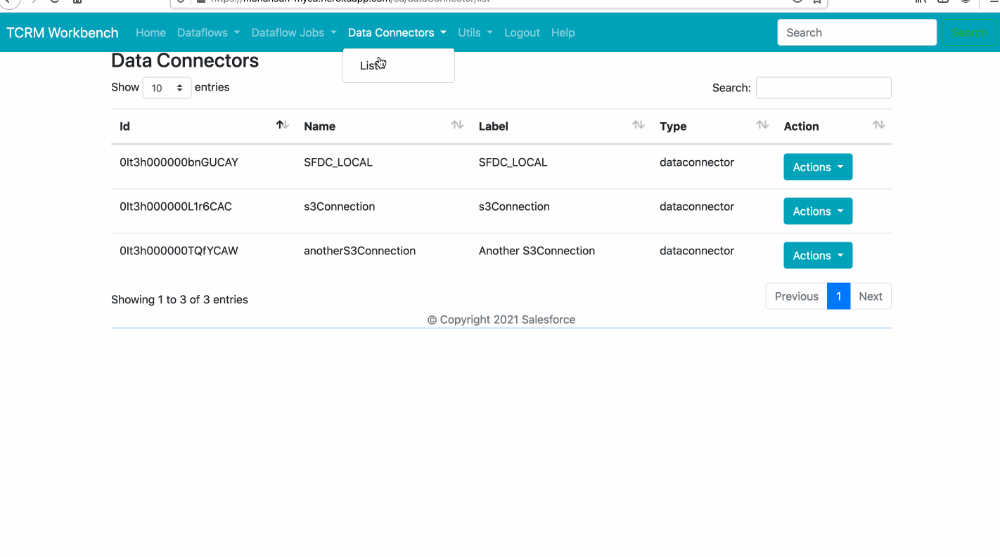
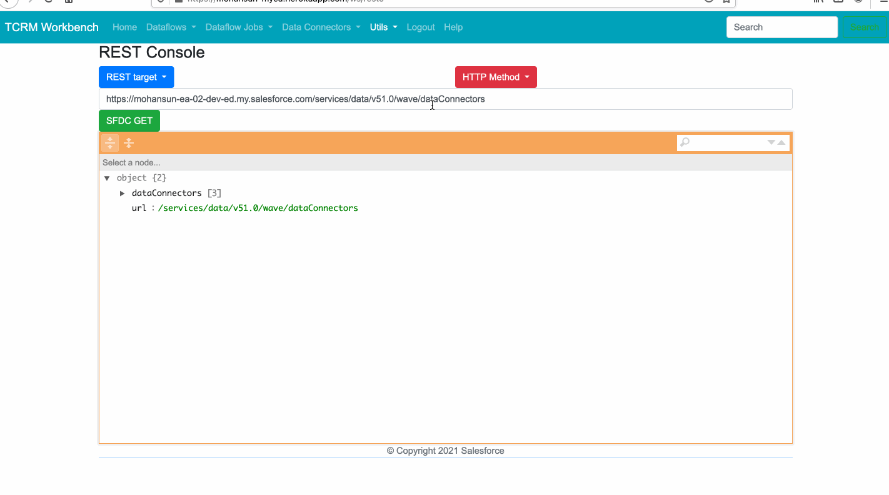
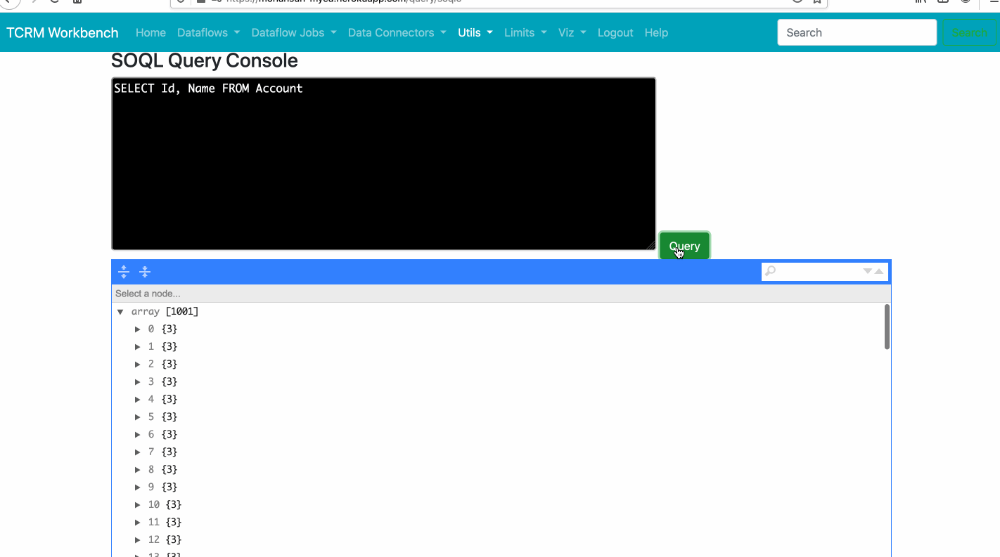
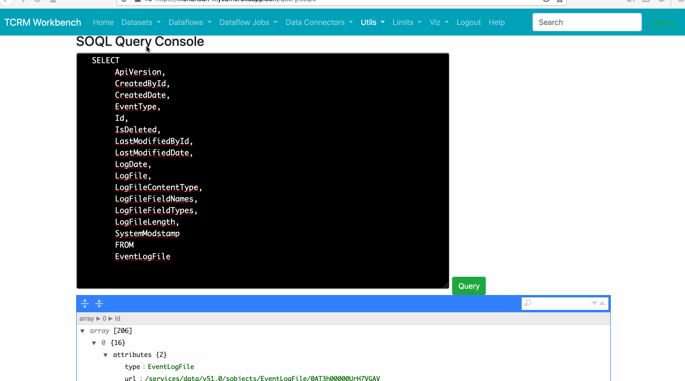
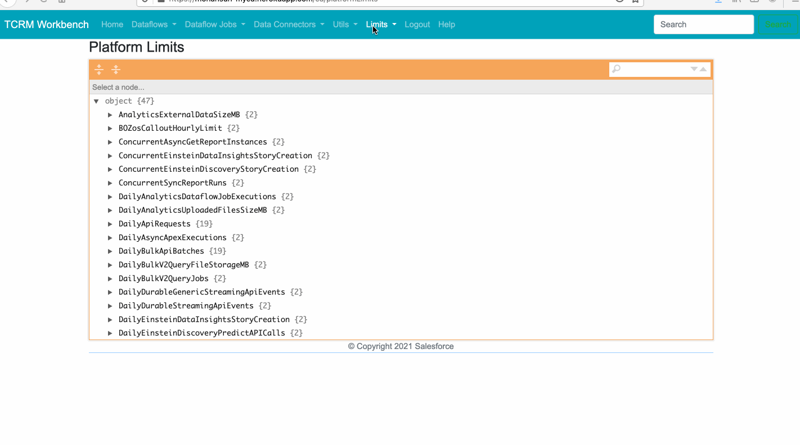
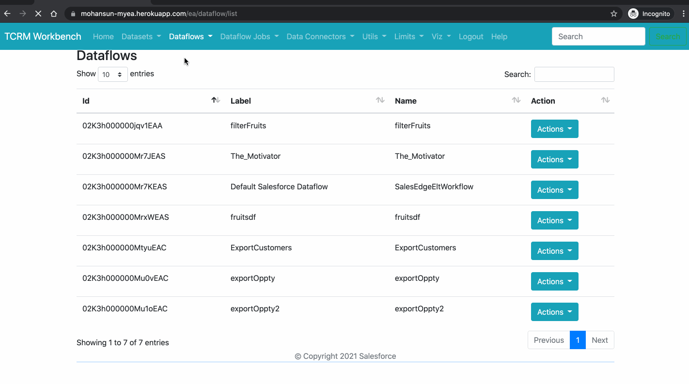
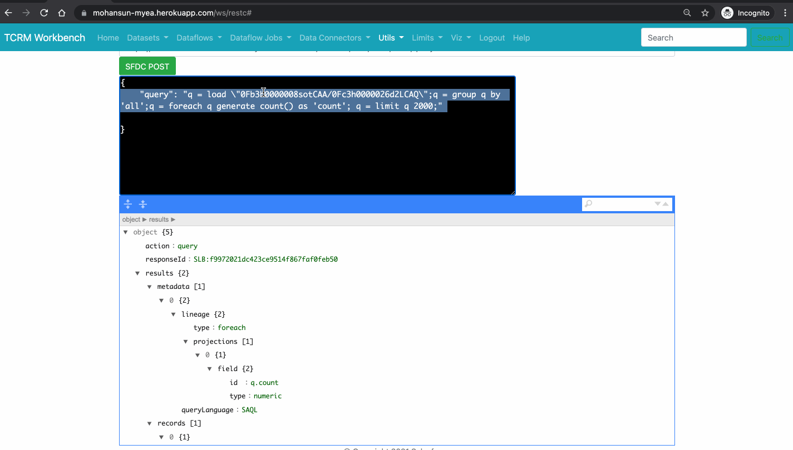
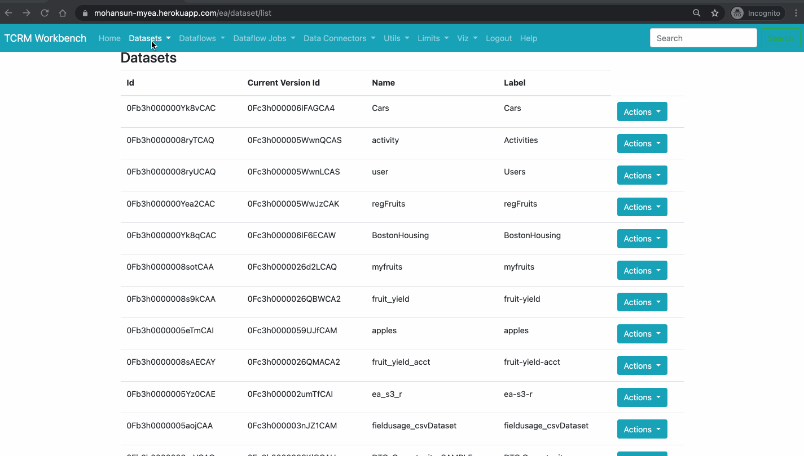

# Tableau CRM Workbench Demos

## Topics
- [Dataflow Field Usage](#dffu)
- [Data Connector](#dc)

- [REST Console](#restc)
- [SOQL Console](#soqlc)


- [Limits - TCRM and Platform](#limits)
- [Assets Counts - TCRM ](#ac)

- [dataflow optimization flow](#dfopt)
- [SAQL in REST console](#saql)
    - [Boston Housing Data SAQL](https://github.com/mohan-chinnappan-n/TCRM-Workbench/blob/master/data/bosting-housing/ea/load.md)
    - [CarsData SAQL](https://github.com/mohan-chinnappan-n/TCRM-Workbench/blob/master/data/cars/ea/load.md)
- [SAQL Console](#saqlc) 
- [Quick Actions](qa/qa.md)

- [Machine Learning with Tensforflow](ml/ml.md)

- [CLI - Plugin Features](https://www.salesforceblogger.com/2020/11/17/mohans-sfdx-plugin-for-analytics/)
    - Most of the features in CLI Plugin will be available in TCRM Workbench!


<a name="dffu"></a>
## Field Usage for a dataflow
-


<a name="dc"></a>
## Data Connectors 
-

<a name="restc"></a>
## REST Console 
-


<a name="soqlc"></a>
## SOQL Console 
-
-


<a name="Limits"></a>
## Limits (TCRM and Platform_ 
-

<a name="ac"></a>
## TCRM Asset Counts 
-

<a name='dfopt'></a>
## Dataflow Optimization Flow
-

<a name='saql'></a>
## Running SAQL using REST console
### SAQL
```
{
    "query": "q = load \"0Fb3h0000008sotCAA/0Fc3h0000026d2LCAQ\";q = group q by 'all';q = foreach q generate count() as 'count'; q = limit q 2000;"
  
}
```
-

### Another SAQL
```
{
    "query": "q = load \"0Fb3h0000008sotCAA/0Fc3h0000026d2LCAQ\";q = foreach q generate 'fruit' as 'fruit' , 'qty' as 'qty'; q = limit q 2000;"
}

```
- Response
```json
{
    "action": "query",
    "responseId": "SLB:1980e9d768305d05672312b14d841350",
    "results": {
        "metadata": [{
            "lineage": {
                "type": "foreach",
                "projections": [{
                    "field": {
                        "id": "q.fruit",
                        "type": "string"
                    },
                    "inputs": [{
                        "id": "q.fruit"
                    }]
                }, {
                    "field": {
                        "id": "q.qty",
                        "type": "numeric"
                    },
                    "inputs": [{
                        "id": "q.qty"
                    }]
                }]
            },
            "queryLanguage": "SAQL"
        }],
        "records": [{
            "fruit": "apple",
            "qty": 30
        }, {
            "fruit": "mango",
            "qty": 78
        }, {
            "fruit": "jackfruit",
            "qty": 70
        }, {
            "fruit": "peach",
            "qty": 2222
        }, {
            "fruit": "apple",
            "qty": 130
        }, {
            "fruit": "mango",
            "qty": 278
        }, {
            "fruit": "jackfruit",
            "qty": 270
        }, {
            "fruit": "peach",
            "qty": 266
        }]
    },
    "query": "q = load \"0Fb3h0000008sotCAA/0Fc3h0000026d2LCAQ\";q = foreach q generate 'fruit' as 'fruit' , 'qty' as 'qty'; q = limit q 2000;",
    "responseTime": 13
}
```
<a name='saqlc'></a>
## SAQL Console




