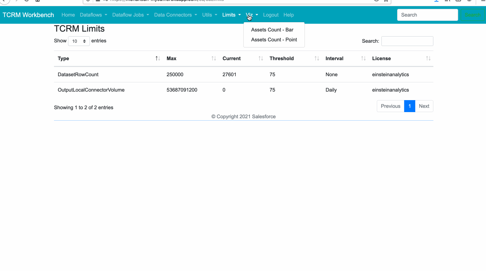

# Tableau CRM Workbench Demos

## Topics
- [Dataflow Field Usage](#dffu)
- [Data Connector](#dc)

- [REST Console](#restc)
- [SOQL Console](#soqlc)


- [Limits - TCRM and Platform](#limits)
- [Assets Counts - TCRM ](#ac)

- [dataflow optimization flow](#dfopt))
- [SAQL in REST console](#saql))


- [CLI - Plugin Features](https://www.salesforceblogger.com/2020/11/17/mohans-sfdx-plugin-for-analytics/)
    - Most of the features in CLI Plugin will be available in TCRM Workbench!


<a name="dffu"></a>
## Field Usage for a dataflow
-


<a name="dc"></a>
## Data Connectors 
-

<a name="restc"></a>
## REST Console 
-


<a name="soqlc"></a>
## SOQL Console 
-
-


<a name="Limits"></a>
## Limits (TCRM and Platform_ 
-

<a name="ac"></a>
## TCRM Asset Counts 
-

<a name='dfopt'></a>
## Dataflow Optimization Flow
-

<a name='saql'></a>
## Running SAQL using REST console
### SAQL
```
{
    "query": "q = load \"0Fb3h0000008sotCAA/0Fc3h0000026d2LCAQ\";q = group q by 'all';q = foreach q generate count() as 'count'; q = limit q 2000;"
  
}
```
-![SAQL using REST Console)(img/saql/saql-1.png)


