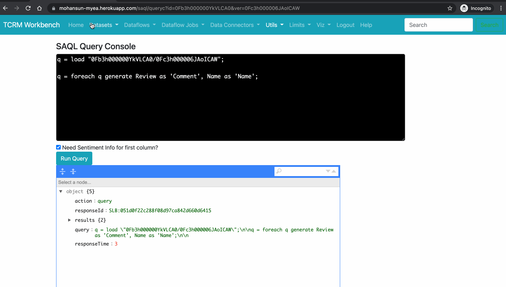

# TCRM Workbench - Machine Learning 

## Topics
- [Regression](#regression)

- [Sentiment Analysis](#sentiment)
- [Q and A ](#qa)

- [Image recognition](#imgrc)
- [Multi Image recognition](#mimgrc)

## Regression

## Sentiment analysis

## Sentiment analysis in SAQL console

## Image Recognition Console

## Multi Image Recognition Console

## Q and A Console

